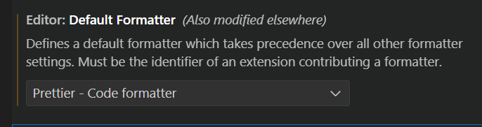
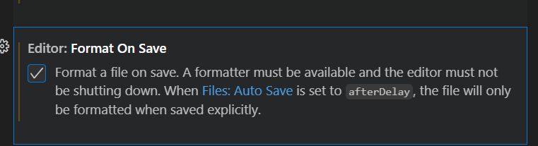

# 手写 react

## 初始化

### pnpm

```bash
pnpm init
```

### pnpm-workspace.yaml

```yaml
packages:
  - 'packages/*'
```

### lint

安装

```bash
pnpm i eslint -D -w
```

初始化

```bash
npx eslint --init
```

### .gitignore

```
/node_modules
```

### ts-lint

```bash
pnpm i -D -w @typescript-eslint/eslint-plugin
```

### prettier

```bash
pnpm i prettier -D -w
```

新建`.prettierrc.json`

```json
{
	"printWidth": 80,
	"tabWidth": 2,
	"useTabs": true,
	"semi": true,
	"singleQuote": true,
	"bracketSpacing": true,
	"trailingComma": "none"
}
```

将`prettier`集成到`eslint`中

```bash
pnpm i eslint-config-prettier eslint-plugin-prettier -w -D
```

package.json中添加script

```json
 "lint": "eslint --ext .ts,.tsx,.jsx --fix --quiet ./packages",
```

在vscode首选项中搜索format



### husky

安装

```
pnpm i husky -D -w
```

初始化

```
npx husky init
```

在.husky/pre-commit 中写以下代码

```
echo "eslint is working ~"

npm exec lint-staged
```

在packages.json中写以下代码

```json
{
	"lint-staged": {
		"packages/**": ["prettier --write", "eslint --cache --fix", "git add"]
	}
}
```

script中同样配置lint

```json
{
	"scripts": {
		"lint-staged": "lint-staged"
	}
}
```
